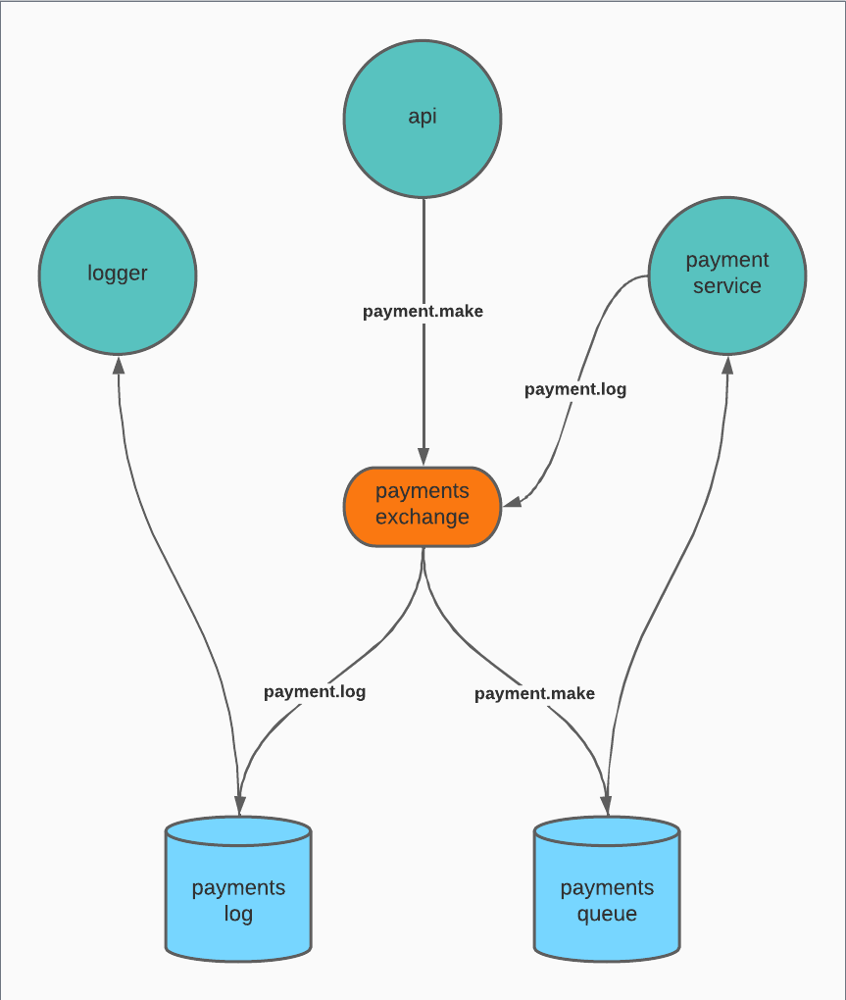

# RabbitMQ payment process

Simulate the behavior of a payment process with logs using RabbitMQ

## Relations on RabbitMQ



## Communication flow


## How to run?


```shell
docker compose up -d
```

- Api

    ```bash
    cd ./Application/Api
    dotnet run
    ```

- PaymentProcessor

    ```bash
    cd ./Application/PaymentProcessor
    dotnet run
    ```

- Logger

    ```bash
    cd ./Application/Logger
    dotnet run
    ```